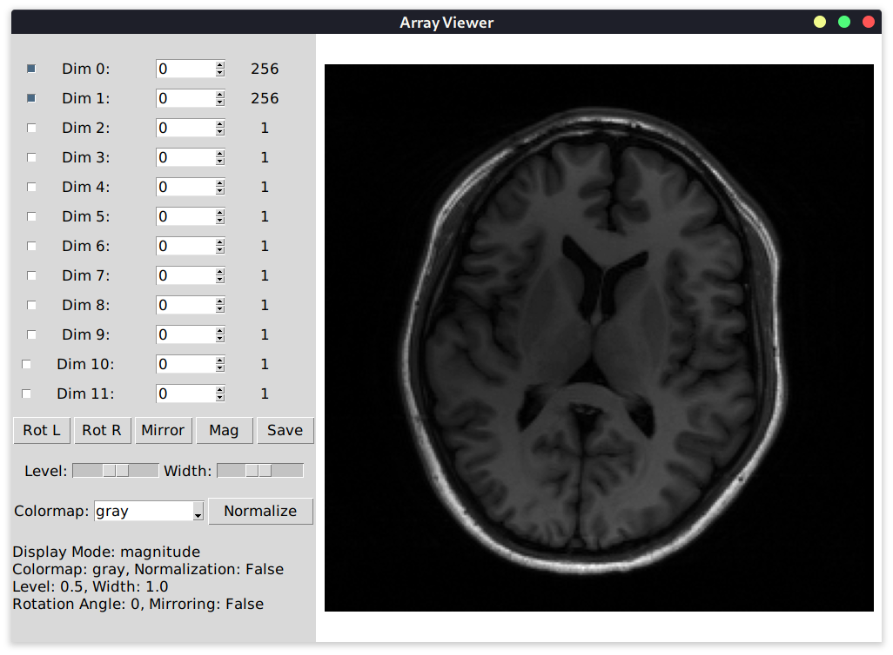

# Array Viewer

Array Viewer is a Python GUI application built with Tkinter that allows users to visualize and interact with multi-dimensional arrays stored in `.cfl` or `.npy` files.



## Features

- Load and visualize multi-dimensional arrays from `.cfl` or `.npy` files.
- Control which dimensions are displayed using checkboxes and spinboxes.
- Rotate and mirror the displayed image.
- Choose from a variety of colormaps for visualization.
- Save the displayed image as a PNG file.

## Requirements

- Python 3.x
- Tkinter
- NumPy
- Matplotlib

## Usage

To run the Array Viewer, execute the following command:

```
python viewer.py path_to_file
```

Replace `path_to_file` with the path to your `.cfl` or `.npy` file.

If you want to display multiple files simultaneously, provide multiple file paths separated by spaces:

```
python viewer.py path_to_file1 path_to_file2 ...
```

## License

This project is licensed under the MIT License - see the [LICENSE](LICENSE) file for details.
